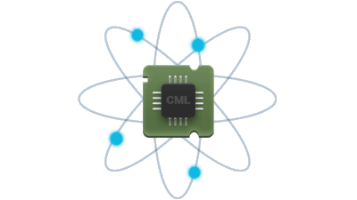
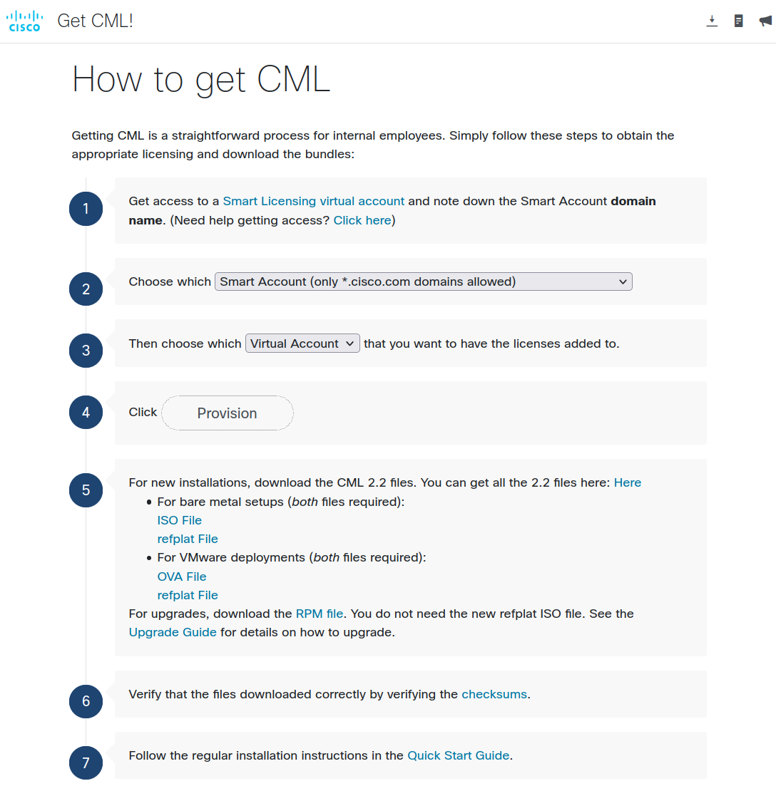
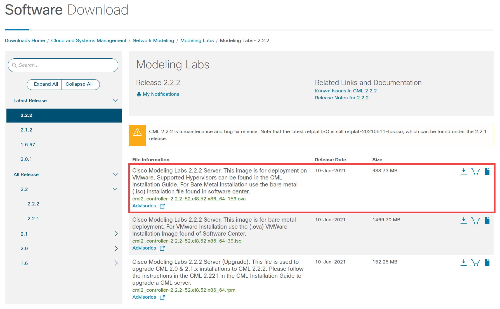
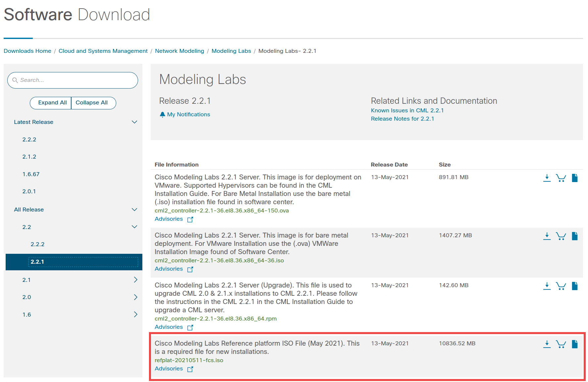
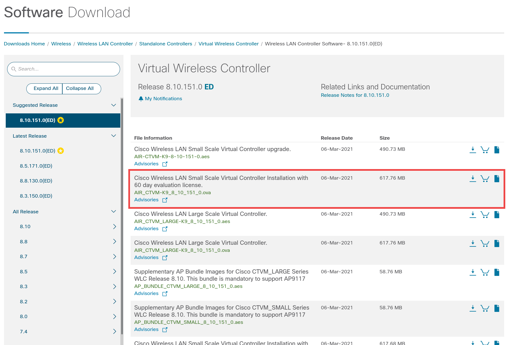

# CML 2.0 Hands-on Lab

Cisco Modeling Labs (CML) is the go-to tool for network simulation of Cisco reference platforms and beyond. In this session, we’re going to  cover the product from A to Z with a special focus on automation.  In addition, we’re going to show how to extend the platform by adding  additional images like a Windows 10 or a vWLC WLAN Controller.

[TOC]

## Agenda

- Installation and licensing of the product
- Cockpit – system management, enabling SSH to access the Linux CLI
- Simulation Life cycle  (simulation state, creating a topology, working with the UI)
- Installation of 3rd Party Image (node and image definition creation, image upload)
- Exploring and using the API via Swagger
- Use of the Python Client Library (PCL)
- virl-utils: taking the PCL to the next level
- Breakout tool: what is it and how to use it
- Accessing consoles using the terminal server
- Additional references and closing

## Prerequisites

The following is needed to successfully complete this hands-on lab:

### Hardware
You need a computer to run CML on.  A standard Cisco laptop should be sufficient to get you up-and-running.  A laptop is somewhat limited in available resources but it should be sufficient to learn the basics and to get a better understanding how to install and run CML on larger computers

- **Memory:** At least 16GB of memory, 8 or 10GB should be dedicated to the CML Virtual Machine
- **CPU:** the more, the merrier… 4 vCPUs / threads should be assigned to the CML Virtual Machine
- **Disk Space:** At least 8GB of free disk space required, more is better especially if you want to install additional images like Windows 10… For Windows 10, you should set at least 16GB of free space aside.

Recommendation:  Use a USB 3.0 portable hard drive to store the images and install the software on.

### License

To run the software, you also need a license.  Internal users can request a license file for a full enterprise version with 20 concurrent node license using this form.

#### Smart Licensing Virtual Account

Note that you do require a virtual account or at least have access to a virtual account.  Details how to do that can be found [here on SharePoint](https://cisco.sharepoint.com/sites/CiscoModelingLabs/SitePages/CML-%26-VIRL---Cisco-Internal-Use-Page.aspx#smart-licensing).

#### Production CML License

The actual CML License will be provisioned into your Smart Licensing Virtual account by using the [tool here](https://scripts.cisco.com/app/Get_CML/).  You need to authenticate and fill in the required info.  This is an automated process and it usually only takes a couple of seconds to complete.

The tool is also referenced on the SharePoint site above.  Note that the tool has direct links to the software images needed (choose the VMware deployment files or see the next section for instructions how to download from CCO):

### Software

#### VMware Fusion or Workstation

CML comes as an OVA to be deployed on VMware products.  To run CML, you need to have a hypervisor installed.  We’re doing the demo using VMware Fusion 11 on a MacBook Pro (standard Cisco issue, 16GB memory, i7 CPU).  Alternatively, you can run on VMware ESXi 6.7 or later in a lab as well if you have access to such infrastructure.

You should also be OK to use a trial license for Fusion / Workstation or use VMware Player, if available on your platform.

#### Cisco Modeling Labs Software

Please download the software before the session starts from CCO.  You need two images, the OVA and the ISO.

https://software.cisco.com/download/home/286193282/type/286326381/release/2.2.2

**Note:** As these images are significant in size, you are advised to do this ahead of time.  Depending on the speed of your connections this can take quite some time.

Download the OVA from the 2.2.2 release:

Also download the reference platform ISO file from the 2.2.1 release:

#### Windows 10 Download

If you want to install Windows 10 as part of this hands-on lab, then you can download the image from Microsoft from the below links… Note that the first Machine is quite big (~20 GB), the Edge Dev VM is much smaller (~7 GB):

- Windows 10 Dev Environment [here](https://developer.microsoft.com/en-us/windows/downloads/virtual-machines/) – choose the VMware disk
- Windows 10 Web Dev VM [here]() – choose MSEdge on Win10 (x64) Stable 1809 / VMware (Windows, Mac)

#### vWLC Download

If you do not want to download or do not have the space for a Windows 10 image then maybe you want to install the virtual Wireless LAN Controller from [CCO here](https://software.cisco.com/download/home/284464214/type/280926587/release/8.10.151.0), choose the OVA ~610MB:

#### CML Platform ISO Alternative Download

If you do not want to download the ISO due to its size, you can download a very minimal ISO [here](http://virl-refplat.cisco.com/refplat-20200401-mini.iso)… This is only ~60MB in size and can be used to quickly test functionality.  Be advised that this only has two small Linux images (TinyCore and Alpine Linux) to work with – no routers, no switches, no virtual Cisco device at all.

#### Python

You need a Python 3.6+ environment to run some of the utilities like the Python client library (PCL) or the VIRL utils.  However, if you do not have Python 3.6 or newer installed locally, then we can leverage Python on the CML VM itself.

#### Other Tooling and Resources

- Internet access to clone repos from GitHub
- Git
- zip/unzip tools
- Terminal client (iTerm, SecureCRT, PuTTY, …)
- VNC Client, [here’s some](https://www.realvnc.com/en/connect/download/viewer/windows/)